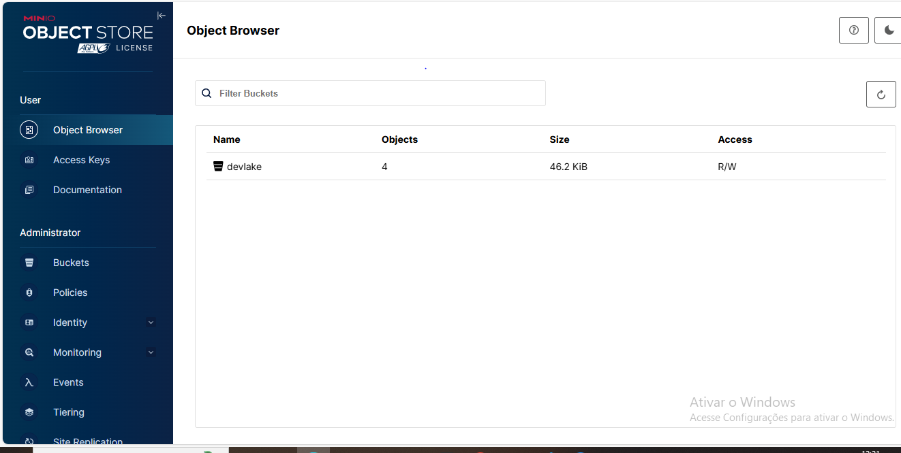
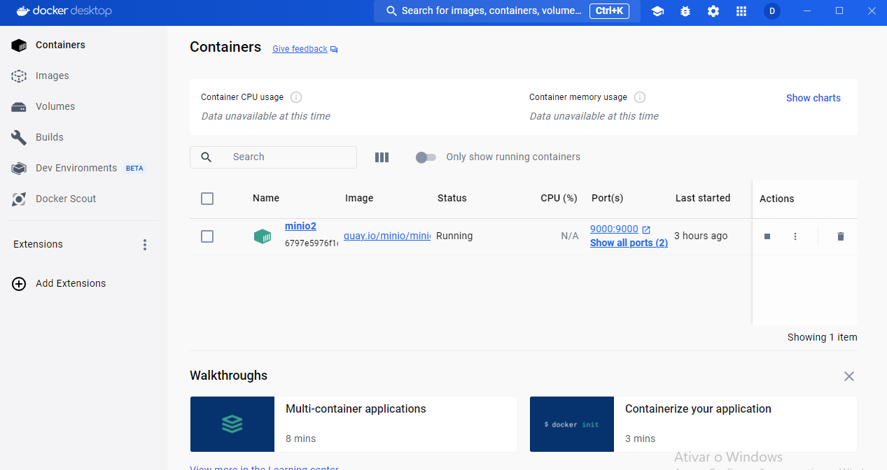

## CONSTRUÇÃO DE UM DATALAKE ON-PREMISE

Por definição os Data Lake é um repositório centralizado projetado para armazenar, processar e proteger grandes quantidades de dados estruturados, semiestruturados e não estruturados. Também são capazes de armazenar dados em formato nativo e processar qualquer variedade deles, sem limites de tamanho.

## OBJETIVO

Este projecto tem como objetivo criar uma solução de engenharia de dados On-Primese sem de forma gratuita. Pois realizar o processo de ETL,  na nuvem exige algum custo devido o uso dos recuros que auxiliam neste tipo de processo, com isso é importante e necessário explorar outras ferramentas que podem ser usadas neste tipo de processo, e principalmente as ferramentas Open  Source. Por isso que me propús em aprender como realizar este processonde forma On-primse para que assim poder criar vários projetos de forma gratuita sem qualque uma preocupação sobre os valores de poder computacional conforme é cobrado no uso de Cloud Computacional.

## PROPOSTA DA SOLUÇÃO 
A empresa ABC lider na região sul de Santa Catarina esta desenvolvendo uma estratégias para coletar, armazenar e usar a base de dados de comentários que os seus clientes enviaram referente ao ano de 2024. E para tal buscando desenvolver uma solução que possa ajudar a personalizar os feedback dos seus clientes e daí melhorar na distribuição dos seus serviços e para que possa aumentar as vendas dos seus produtos reduzindo a taxa de churn de seus clientes e aumentando o faturamento através da criação de estratégia por meio do uso da Engenharia e Ciência de Dados. 

## ARQUITETURA

## TECNOLOGIAS USADAS
- Python
- PySpark
- Framework Flask

## FERRAMENTAS
- VSCode
- MinIO
- DOCKER

## AMBIENTE

MinIO

DOCKER

## AUTOR
Laurindo Dumba

